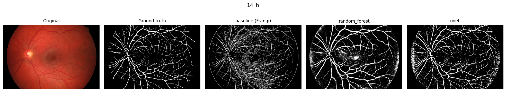
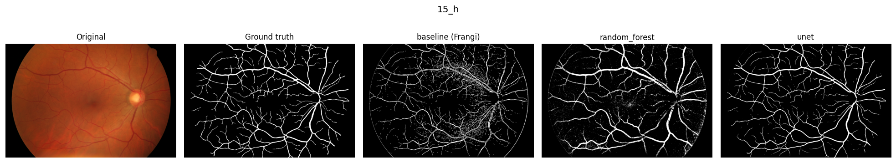
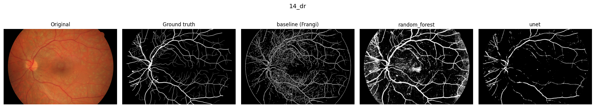
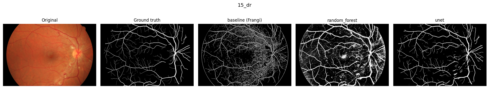
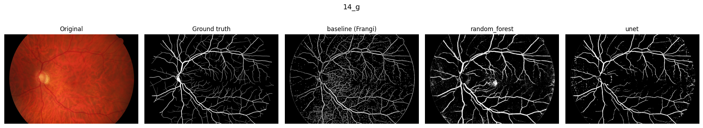
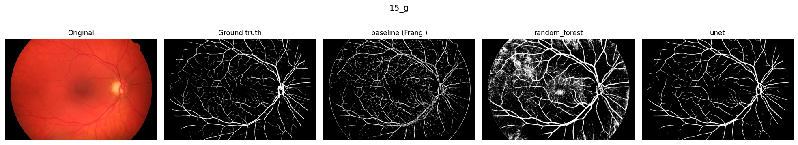
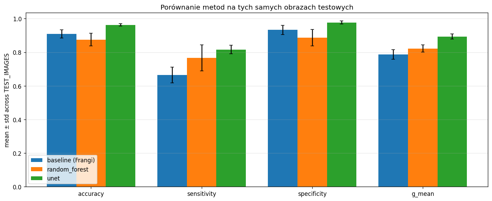

# Wykrywanie naczyń dna oka

- Illia Yanukovich 159788
- Vladyslav Vatslavyi 161317

## 2. Zastosowany język programowania oraz dodatkowe biblioteki

Projekt jest napisany w Pythonie 3.10+ i podzielony na cztery notebooki Jupyter w katalogu `notebooks/`. `01_baseline.ipynb` to przetwarzanie obrazu (Frangi + morfologia, wymagania obowiązkowe), `02_classical_ml.ipynb` to Random Forest na patchach 5×5 (na 4.0), `03_deep_learning.ipynb` to U-Net w PyTorch (na 5.0), a `app.ipynb` to interaktywna aplikacja z porównaniem trzech metod. Wspólny kod siedzi w modułach `src/*.py`.

Do obliczeń numerycznych używamy NumPy i SciPy. Pierwszy etap opiera się na scikit-image (filtr Frangiego, próg Otsu, morfologia) i OpenCV (CLAHE, momenty Hu, gradient Sobela), a obrazy i maski wczytujemy przez Pillow. W drugim etapie korzystamy z scikit-learn (Random Forest, podział train/val, macierz pomyłek) i imbalanced-learn (`RandomUnderSampler` do zrównoważenia klas). U-Net zbudowaliśmy w PyTorch z dodatkami `segmentation-models-pytorch`, `albumentations`, `MONAI` i `PyTorch Lightning`. Tabele, wykresy, widgety i pasek postępu robimy w pandas, matplotlib, ipywidgets i tqdm.

**Baza obrazów:** HRF Image Database (<https://www5.cs.fau.de/research/data/fundus-images/>), 45 obrazów dna oka w trzech kategoriach: 15 zdrowych (`h`), 15 z retinopatią cukrzycową (`dr`), 15 z jaskrą (`g`). Każdy obraz ma ekspercką maskę naczyń (`manual1/`) i maskę pola widzenia FOV (`mask/`). Ta sama baza jest we wszystkich trzech etapach.

Podział hold-out jest ustalony w `src/config.py` i taki sam dla wszystkich metod: 39 obrazów uczących i 6 testowych (`14_h`, `15_h`, `14_dr`, `15_dr`, `14_g`, `15_g`, po dwa z każdej kategorii). Test jest zamrożony i nie zmienia się między etapami, żeby porównanie metod było uczciwe.

---

## 3. Opis zastosowanych metod

### 3.1. Przetwarzanie obrazów

Cały etap to klasyczny potok bez uczenia, z kodem w `src/preprocessing.py` i `src/baseline.py`. Najpierw bierzemy kanał zielony, bo na nim naczynia mają największy kontrast, piksele poza FOV wypełniamy medianą pikseli z wnętrza FOV, a kontrast wyrównujemy lokalnie filtrem CLAHE (`clipLimit=2.0`, `tileGridSize=(8,8)`), który nie podbija za mocno szumu. Potem filtr Frangiego (`sigmas=(1,2,3,4,5)`, `black_ridges=True`) szuka struktur rurkowych w wielu skalach; jego odpowiedź normalizujemy do `[0, 1]` i progujemy metodą Otsu liczoną tylko po pikselach FOV. Gdybyśmy liczyli też czarne tło ramki, próg poszedłby w stronę zera i naczynia by zniknęły. Na końcu czyścimy maskę: usuwamy małe komponenty (`remove_small_objects`, `min_size=60`), domykamy drobne przerwy zamknięciem morfologicznym o promieniu 1 i przycinamy wynik do FOV.

Filtr Frangiego to klasyczny detektor naczyń o dowolnej orientacji, oparty na analizie wartości własnych hesjanu obrazu w wielu skalach. W parze z CLAHE i progiem Otsu daje sensowny baseline bez uczenia maszynowego, a morfologia dodatkowo czyści wynik z drobnego szumu.

### 3.2. Klasyczne uczenie maszynowe

Z każdego obrazu uczącego losujemy 5000 patchy 5×5 z wnętrza FOV. Etykietą patcha jest wartość maski eksperckiej w jego środkowym pikselu. Z patcha liczymy wektor 24 cech: 6 statystyk RGB (średnia i wariancja w każdym kanale), 2 cechy środkowego piksela (zielony surowy i po CLAHE), 4 statystyki patcha na kanale zielonym (mean, var, min, max), 7 momentów Hu z patcha binaryzowanego progiem średniej jasności (niezmiennicze na skalę i obrót), 3 momenty centralne (`mu20`, `mu02`, `mu11`) oraz 2 statystyki magnitudy gradientu Sobela (mean i var).

Pełny zbiór dzielimy stratyfikowanie w proporcji 2/3 : 1/3 na train/val. Na części uczącej robimy undersampling klasy „tło" (`RandomUnderSampler`, `sampling_strategy='auto'`), żeby wyrównać klasy do 50/50. Resampling działa tylko podczas `fit`, bo jest opakowany w `imblearn.Pipeline(undersample -> rf)`. Klasyfikatorem jest Random Forest (`sklearn.ensemble.RandomForestClassifier`) z `n_estimators=100`, `max_depth=None`, `min_samples_leaf=2` i `random_state=42`.

Średnie wyniki hold-out po 6 obrazach testowych (z `02_classical_ml.ipynb`):

| accuracy        | sensitivity     | specificity     | g_mean          |
| --------------- | --------------- | --------------- | --------------- |
| 0.8755 ± 0.0383 | 0.7659 ± 0.0773 | 0.8865 ± 0.0493 | 0.8219 ± 0.0212 |

Random Forest wybraliśmy, bo dobrze radzi sobie z nieliniowymi zależnościami między cechami i nie wymaga skalowania danych (w odróżnieniu od np. SVM). Cechy łączą kolor (statystyki RGB i G), kształt (momenty Hu i centralne) oraz krawędzie (gradient Sobela), więc klasyfikator patrzy na patch z kilku stron naraz.

### 3.3. Głębokie uczenie (wymagania na 5.0)

Architekturą jest U-Net z `segmentation_models_pytorch`: encoder ResNet-34 pretrenowany na ImageNet i dekoder uczony od zera. Wejściem są 3 kanały RGB, a wyjściem 1 kanał (logit prawdopodobieństwa naczynia).

Z puli 39 obrazów uczących odkładamy 6 na inner-val, żeby w trakcie treningu śledzić G-mean i wybrać najlepszy checkpoint; zbiór `TEST_IMAGES` zostaje nietknięty do końcowej oceny. Z każdego obrazu losujemy kropy 256×256 z wnętrza FOV, po 64 na obraz na epokę, ze środkami przesuniętymi w stronę pikseli naczyniowych (`vessel_prob=0.5`), dzięki czemu połowa kropów zawiera naczynia, mimo że to tylko ok. 10% pikseli. Kropy obracamy o `k·90°` i odbijamy w poziomie oraz pionie (`albumentations`), a potem normalizujemy per-kanał statystyką ImageNet, której wymaga pretrenowany encoder.

Sieć uczymy optymalizatorem Adam z `lr=1e-3` i schedulerem `ReduceLROnPlateau` (`factor=0.5`, `patience=3`). Funkcją straty jest BCE-with-logits + Dice, obie maskowane przez FOV. Trenujemy 30 epok z batchem 8, a całość spina pętla z PyTorch Lightning. Zapisujemy ten checkpoint, który ma najlepszy G-mean na inner-val (u nas epoka 11, val_gmean = 0.9134).

Predykcję na pełnym obrazie robimy przez `monai.inferers.sliding_window_inference`: tniemy obraz na kafelki 256×256 z overlapem 32 px, uśredniamy prawdopodobieństwa na nakładkach, progujemy 0.5 i przycinamy do FOV.

U-Net jest standardem w segmentacji medycznej. Skip-connections łączą kontekst z głębokich warstw encodera z dokładnością pikselową z płytkich warstw, co jest ważne przy cienkich naczyniach. Gotowy encoder ImageNet jest tu prawie konieczny, bo 33 obrazy uczące to za mało, by uczyć U-Net od zera. Połączony loss BCE+Dice radzi sobie z dysbalansem klas (Dice) i jednocześnie wymusza dokładność pikselową (BCE).

---

## 4. Wizualizacja wyników

Dla każdego z 6 obrazów testowych poniżej zaprezentowano oryginał, maskę ekspercką oraz predykcje trzech metod (baseline / Random Forest / U-Net). Wszystkie obrazy testowe są rozłączne ze zbiorem uczącym we wszystkich etapach.

### 4.1. Obraz `14_h` (zdrowy)

### 4.2. Obraz `15_h` (zdrowy)

### 4.3. Obraz `14_dr` (retinopatia cukrzycowa)

### 4.4. Obraz `15_dr` (retinopatia cukrzycowa)

### 4.5. Obraz `14_g` (jaskra)

### 4.6. Obraz `15_g` (jaskra)

---

## 5. Analiza wyników

### 5.1. Wyniki zbiorcze (mean ± std po 6 obrazach testowych)

| metoda            | accuracy        | sensitivity     | specificity     | g_mean          |
| ----------------- | --------------- | --------------- | --------------- | --------------- |
| baseline (Frangi) | 0.9094 ± 0.0245 | 0.6645 ± 0.0462 | 0.9332 ± 0.0273 | 0.7870 ± 0.0295 |
| random_forest     | 0.8755 ± 0.0383 | 0.7659 ± 0.0773 | 0.8865 ± 0.0493 | 0.8219 ± 0.0212 |
| unet              | 0.9629 ± 0.0078 | 0.8165 ± 0.0256 | 0.9772 ± 0.0086 | 0.8932 ± 0.0154 |

### 5.2. Wyniki indywidualne (per obraz x per metoda)

| obraz | metoda        | accuracy | sensitivity | specificity | g_mean |
| ----- | ------------- | -------- | ----------- | ----------- | ------ |
| 14_h  | baseline      | 0.9018   | 0.7381      | 0.9206      | 0.8243 |
| 14_h  | random_forest | 0.8870   | 0.7809      | 0.8992      | 0.8380 |
| 14_h  | unet          | 0.9692   | 0.8488      | 0.9830      | 0.9134 |
| 15_h  | baseline      | 0.9363   | 0.6598      | 0.9645      | 0.7977 |
| 15_h  | random_forest | 0.9257   | 0.6668      | 0.9522      | 0.7968 |
| 15_h  | unet          | 0.9760   | 0.8229      | 0.9916      | 0.9033 |
| 14_dr | baseline      | 0.8953   | 0.5964      | 0.9250      | 0.7428 |
| 14_dr | random_forest | 0.8533   | 0.7813      | 0.8604      | 0.8199 |
| 14_dr | unet          | 0.9577   | 0.7851      | 0.9748      | 0.8749 |
| 15_dr | baseline      | 0.8711   | 0.6542      | 0.8893      | 0.7627 |
| 15_dr | random_forest | 0.8349   | 0.8463      | 0.8340      | 0.8401 |
| 15_dr | unet          | 0.9591   | 0.8339      | 0.9696      | 0.8992 |
| 14_g  | baseline      | 0.9229   | 0.6845      | 0.9446      | 0.8041 |
| 14_g  | random_forest | 0.9116   | 0.6793      | 0.9328      | 0.7960 |
| 14_g  | unet          | 0.9587   | 0.7869      | 0.9744      | 0.8756 |
| 15_g  | baseline      | 0.9288   | 0.6540      | 0.9549      | 0.7903 |
| 15_g  | random_forest | 0.8406   | 0.8407      | 0.8405      | 0.8406 |
| 15_g  | unet          | 0.9568   | 0.8216      | 0.9697      | 0.8926 |

### 5.4. Porównanie metod

Po uśrednieniu po 6 obrazach testowych U-Net uzyskuje najlepsze wartości wszystkich badanych metryk: 0.9629 accuracy, 0.8165 sensitivity, 0.9772 specificity i 0.8932 g_mean. Ma również najmniejsze odchylenie standardowe między obrazami (0.015 dla g_mean, RF 0.021, baseline 0.030), więc utrzymuje stabilny poziom niezależnie od kategorii obrazu (zdrowy, retinopatia, jaskra).

Random Forest plasuje się pośrodku, ale jego charakterystyka różni się od baseline'u: ma znacznie wyższą sensitivity (0.77 vs 0.66) kosztem niższej specificity (0.89 vs 0.93). RF znajduje więcej naczyń, ale jednocześnie generuje sporo fałszywych dodatnich. Widać to wyraźnie na obrazach z patologiami (`15_dr`, `15_g`), gdzie sensitivity rośnie do 0.85, ale specificity spada do 0.83-0.84.

Baseline (Frangi + Otsu) zachowuje wysoką specificity (0.93), ponieważ filtr Frangiego z założenia jest selektywny i nie wykrywa naczyń tam, gdzie ich nie ma. Płaci za to niską sensitivity (0.66), bo gubi naczynia cienkie i słabo kontrastowe. To metoda dobra do szybkiego, zachowawczego baseline'u, ale samodzielnie nie nadaje się tam, gdzie zależy nam na czułości.

Wartości g_mean (baseline 0.79, RF 0.82, U-Net 0.89) układają się w kolejności zgodnej z rosnącą złożonością modeli: prosty filtr obrazu, model uczący się z ręcznie zaprojektowanymi cechami, sieć ucząca się reprezentacji z surowych pikseli. Razem z jakością rośnie też koszt obliczeniowy: baseline daje wynik w ~1 sekundę na obraz, Random Forest potrzebuje ~30 s przy `stride=2`, a U-Net wymagał ~1 godziny treningu na układzie Apple M1 (MPS), a sama predykcja na obrazie testowym to już tylko ~3 s.
